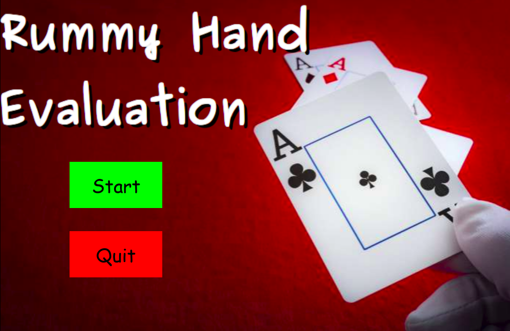
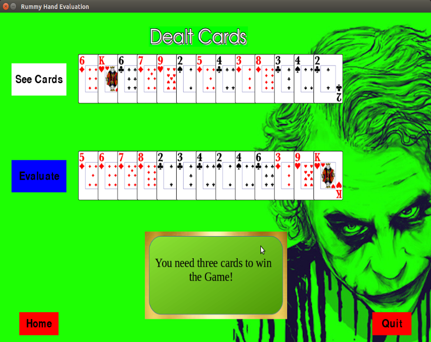

<b>RUMMY-HAND-EVALUATION</b>
 

Rummy is a group of matching-card games notable for similar gameplay based on matching cards of the same rank or sequence and same suit. The basic goal in any form of rummy is to build melds which consists of sets, three or four of a kind of the same rank; or runs, three or more cards in sequence, of the same suit. 
Rummy Hand Evaluation(RHE) typically estimates number of card replacements required to win the game. 
RHE was implemented using python3-pygame. 
The project contains two main files(with and without graphics) which can be executed by python3 commands.

  
  

 
